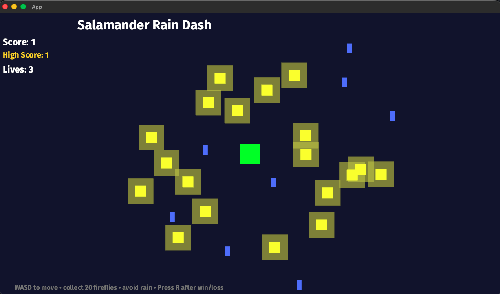

# Salamander Rain Dash

A small survival-collection game built with **Rust**, **Bevy 0.13**, and **GitHub Copilot** for the Agentic Vibe Coding activity.

## Overview

Salamander Rain Dash is a Bevy game where the player controls a salamander, collects glowing fireflies, and avoids falling rain.

The goal is to collect all fireflies before losing all 3 lives. As the player collects more fireflies, the rain falls faster, increasing the difficulty.

This project was intentionally built in a technology stack that was unfamiliar to me (Rust and Bevy) while using an AI coding agent to help generate and modify code.

---

## Features

### Player Movement
- Move using:
  - W = Up
  - A = Left
  - S = Down
  - D = Right

### Firefly Collection
- Glowing fireflies are placed around the map.
- Collecting a firefly increases your score.
- Fireflies disappear when collected.

### Rain Hazard
- Rain continuously falls from the top of the screen.
- Touching rain causes damage.

### Lives System
- Start with 3 lives.
- Lose 1 life when hit by rain.
- Player resets to the center after taking damage.

### Hit Cooldown
- 1 second of invulnerability after taking damage.
- Prevents losing multiple lives instantly.

### Dynamic Difficulty
- Rain speed increases as score increases.
- Makes the game progressively harder.

### Win Condition
Collect all fireflies to save the salamander.

Displays:

```text
You saved the salamander! Press R to play again.
```

### Lose Condition
Lose all 3 lives.

Displays:

```text
You lost! Press R to restart.
```

### Restart System
Press:

```text
R
```

to restart after winning or losing.

---

## Technologies Used

- Rust
- Bevy 0.13
- Git
- GitHub
- GitHub Copilot

---

## Project Structure

```text
src/
 └── main.rs

assets/
 └── fonts/
      └── FiraSans-Bold.ttf
```

Everything is implemented inside a single:

```text
src/main.rs
```

file.

---

## How To Run

### Clone Repository

```bash
git clone https://github.com/alstondsouza1/salamander-rain-game.git
cd salamander-rain-game
```

### Run

```bash
cargo run
```

---

## Controls

| Key | Action |
|------|---------|
| W | Move Up |
| A | Move Left |
| S | Move Down |
| D | Move Right |
| R | Restart Game |

---

## Screenshot




---

## What I Learned

This project introduced me to:

- Agentic AI-assisted development
- Rust basics
- Bevy game engine concepts
- ECS (Entity Component System)
- Collision detection
- Timers and cooldown systems
- Game state management
- Iterative development with Git commits

The most effective strategy was building one small feature at a time, testing frequently, and committing working versions before moving to the next feature.

Some challenges included debugging Bevy compilation errors, fixing game logic issues, and learning how to guide the AI agent when it became stuck or generated incorrect code.

---

## Reflection on AI-Assisted Development

What worked well:

- Generating initial game mechanics
- Creating UI elements
- Implementing timers and collision systems
- Rapidly adding new features

What was difficult:

- Debugging compiler errors
- Fixing broken game logic
- Resolving Bevy-specific issues
- Preventing the AI from introducing new bugs while fixing old ones

One improvement I would make next time is to plan the game features in more detail before coding and make smaller, more focused requests to the AI agent.

---

## Future Improvements

Potential future features include:

- Salamander sprite artwork instead of a green square
- Sound effects
- Pause menu
- High score tracking
- Randomized rain patterns
- Additional levels
- Better visual effects
- Particle animations
- Animated fireflies
- Background music